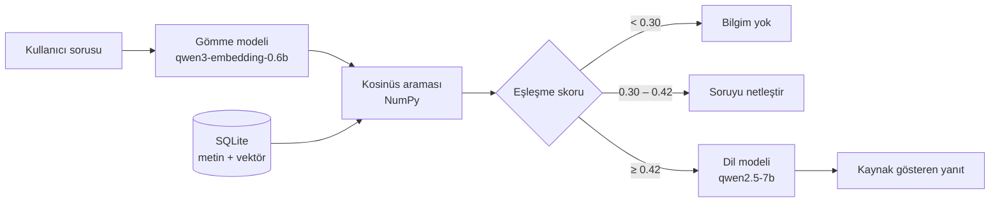

# Börteçine — Yerel Belge Asistanı

Tamamen çevrimdışı çalışan bir soru-cevap asistanı. Türk tarihi ve kültürü
üzerine hazırlanmış belgelere soru soruyorsunuz; sistem ilgili bölümleri kendi
veritabanında buluyor, bunları bir dil modeline bağlam olarak veriyor ve yanıtı
kaynak göstererek üretiyor. Hiçbir veri buluta gitmiyor — model, veritabanı ve
arama, hepsi aynı bilgisayarda çalışıyor.

Adını Ergenekon Destanı'nda topluluğa yolu gösteren bozkurttan alıyor.

Microsoft Foundry Local yaz stajı projesi kapsamında geliştirildi.

## Mimari



Dört katman var: soruyu vektöre çeviren **gömme**, saklanan vektörlerle
karşılaştıran **arama**, sonucu yazıya döken **üretim**, ve ikisinin arasında
duran **üç kademeli eşik**. Eşik, alakasız soruların dil modeline hiç
ulaşmamasını sağlıyor.

Foundry Local, modeli OpenAI uyumlu bir HTTP uç noktası üzerinden sunuyor. Bu
sayede uygulama kodu belirli bir sağlayıcıya bağlı değil: yalnızca temel adres
değiştirilerek başka bir arka uca yönlendirilebilir.

## Kurulum (macOS)

```bash
brew tap microsoft/foundrylocal
brew install foundrylocal

foundry model download qwen3-embedding-0.6b
foundry model download qwen2.5-7b

python3 -m venv .venv
source .venv/bin/activate
pip install -r requirements.txt

python ingest.py
python embed.py
```

## Kurulum (Windows)

```powershell
winget install Microsoft.FoundryLocal
# PowerShell'i kapatıp yeniden açın

foundry model download qwen3-embedding-0.6b
foundry model download qwen2.5-7b

python -m venv .venv
.venv\Scripts\activate
pip install -r requirements.txt

python ingest.py
python embed.py
```

PowerShell betik çalıştırmayı engellerse:
`Set-ExecutionPolicy -Scope Process -ExecutionPolicy Bypass`

Foundry Local şu an Windows ve macOS destekliyor. Linux'ta, OpenAI uyumlu API
sunan başka bir çalışma zamanı (örneğin Ollama) `FOUNDRY_ENDPOINT` ortam
değişkeniyle kullanılabilir.

## Çalıştırma

```bash
streamlit run app.py    # tarayıcı arayüzü
python masaustu.py      # masaüstü penceresi (Tkinter)
python rag.py "soru"    # komut satırı
```

Üç arayüz de aynı `answer()` fonksiyonunu çağırır; iş mantığı tek yerdedir.

Kendi belgelerinizi kullanmak için `docs/` klasörünün içeriğini değiştirip
`ingest.py` ve `embed.py` komutlarını tekrar çalıştırmanız yeterli.

## Proje yapısı

| Dosya | Görevi |
|---|---|
| `ingest.py` | Belgeleri paragraf sınırlarından bölümlere ayırır, SQLite'a yazar |
| `embed.py` | Her bölüm için gömme vektörü üretir, BLOB olarak saklar |
| `search.py` | Soruyu gömer, kosinüs benzerliğiyle en yakın bölümleri bulur |
| `rag.py` | Eşik kontrolü, istem oluşturma, dil modeli çağrısı |
| `evaluate.py` | 12 soruluk değerlendirme setini çalıştırır, rapor üretir |
| `app.py` | Streamlit web arayüzü |
| `masaustu.py` | Tkinter masaüstü arayüzü |
| `foundry_client.py` | Foundry Local uç noktasını ve model adlarını bulur |

## Belge koleksiyonu

`docs/` klasöründe Türk tarihi ve kültürü üzerine 13 belge, toplam 53 bölüm
bulunuyor: ilk Türk devletleri, Selçuklular ve Malazgirt, Osmanlı padişahları,
Çanakkale ve Kurtuluş Savaşı, Cumhuriyet dönemi, Türk kültüründe at ve kurt,
Türk destanları, devlet geleneği, Türkçenin tarihi, milliyetçilik akımının
doğuşu ve öne çıkan isimler.

Belgeler yayımlanmış kaynaklardan derlenerek yazılmıştır. Kaynağı
doğrulanamayan anlatılar, olgu olarak değil, doğrulanmamış oldukları belirtilerek
aktarılmıştır.

## Değerlendirme

12 soruluk bir set kullanıldı: 9'u belgelerden cevaplanabilir, 3'ü
cevaplanamaz (biri anlamsız girdi). Ölçümler `temperature=0` ile yapıldığından
tekrarlanabilir.

| Ölçüt | Sonuç |
|---|---|
| Genel başarı | **12 / 12** |
| Retrieval (doğru belge bağlamda) | **9 / 9** |
| Doğru reddetme | 3 / 3 |
| Ortalama yanıt süresi | 17.7 sn |
| Modele giden soruların ortalaması | 21.2 sn |
| Eşikte reddedilen soruların süresi | < 0.2 sn |

Ayrıntılı tablo ve tüm yanıtlar: [`eval_results.md`](eval_results.md)

Belge havuzu 40 bölümden 53 bölüme çıkarıldığında da aynı sonuç alındı.

### Geniş ölçüm seti (40 soru)

12 soruluk set, getirme katmanını ayırt etmek için dar kalıyordu. 13 belgenin
tamamını kapsayan 32 cevaplanabilir + 8 cevaplanamaz soruluk ikinci bir set
kuruldu. Getirme ölçümleri (recall) dil modeli çağrılmadan, yalnızca gömme
katmanı üzerinde yapıldığı için saniyeler içinde tekrarlanabilir.

| Ölçüt | Önce | Sonra |
|---|---|---|
| recall@1 (doğru belge ilk sırada) | %81 | **%91** |
| recall@3 | %91 | **%97** |
| Doğru belge modele giden bağlamda | 28 / 32 | **32 / 32** |
| Kaynak satırı doğru belgeyi gösteriyor | ölçülmemişti | **32 / 32** |
| Cevabı olduğu hâlde reddedilen soru | 4 / 32 | **0 / 32** |
| Cevaplanamaz soruyu doğru reddetme | 8 / 8 | **8 / 8** |
| Ortalama bağlam uzunluğu | 2124 karakter | **1938 karakter** |

## Yapılan deneyler

Her satır bir hipotez, bir müdahale ve bir ölçüm içerir.

| Değişiklik | Gerekçe | Sonuç |
|---|---|---|
| Bölüm boyutu 500 → 900, örtüşme 100 → 200 | Model, ilgili paragraf bölünmüş olduğu için olmayan bir adım uydurmuştu | Yanıt düzeldi |
| `max_tokens` sınırı ve kısalık talimatı | Yanıtlar gereksiz uzundu; üretim süresi uzunlukla doğru orantılı | 45.2 sn → 10.0 sn |
| Eşik 0.45 → 0.42 | Cevabı belgelerde olan bir soru (skor 0.440) yanlışlıkla reddediliyordu | Yanlış reddetme ortadan kalktı |
| `temperature` 0.2 → 0.0 | Aynı girdi iki farklı sonuç veriyordu; ölçüm güvenilir değildi | Sonuçlar tekrarlanabilir hale geldi |
| Reddetme kuralı istemin başına alındı | Kural listenin ortasındayken model onu atlıyordu | 10/12 → 11/12 |
| `TOP_K` 3 → 5 (sabit) | Büyük bir belgede doğru bölüm ilk üçe giremiyordu | 11/12 → 8/12, süre 4 katına çıktı; **geri alındı** |
| Sorguya gömme modelinin yönerge öneki eklendi | qwen3-embedding sorgu tarafında `Instruct: … Query: …` biçimi bekliyor; öneksiz sorguda skorlar düşük kalıyordu | 32 soruluk sette recall@3 %91 → **%97**, ortalama skor +0.09 |
| Skora %15 sözcüksel örtüşme karıştırıldı | "Dokuz Işık", "Dandanakan" gibi özel adlarda gömme vektörü zayıf kalıyordu | recall@1 %84 → **%91**; eşiği geçen doğru soru 28/32 → **32/32** |
| Sabit `TOP_K` yerine uyarlanabilir bağlam (oran 0.70, 2–5 bölüm, 2800 karakter bütçe, belge başına 2 bölüm) | Süre neredeyse tamamen bağlam uzunluğuna bağlı (~7.7 sn / 1000 karakter); sabit 5 bölüm her soruya +10 sn ekliyordu | Doğru belge kapsaması 32/32 korunurken ortalama bağlam 3501 → **1938 karakter** |
| Kaynak satırı üretim sonrası doğrulanıyor | Model kaynağı ya hiç yazmıyor ya da cevabı bir belgeden alıp listenin ilk sırasındaki başka belgeyi gösteriyordu ("Kut nedir?") | Kaynak, cevabın sözcük olarak en çok örtüştüğü belgeye düzeltiliyor |
| Özel adlar üretim sonrası denetleniyor ve onarılıyor | Model adları Türkçe ekle çekimlerken bozuyordu ("Türkeş'in" → "Türkş'in", hatta "Türkşeddin Esat Paşa"); modele yeniden ürettirmek aynı hatayı tekrarladı | Bağlamda karşılığı olmayan ad, en yakın gerçek yazımıyla değiştiriliyor; 32 doğru yanıtın hiçbiri değişmedi |
| Kök çıkarma Türkçe küçültmeye geçirildi | Python'da `"İ".lower()` iki karakterli `i̇` üretiyor; "İlimcilik" ile "ilimcilik" ayrı kelime sayılıyordu | Sözcüksel eşleşmedeki yanlış alarmlar sıfırlandı |
| Yanıt akışlı (streaming) üretiliyor | Yanıtın tamamı 20–30 sn sürüyor, ekran o süre boyunca boş kalıyordu | İlk kelimeler ~15 sn'de görünüyor; bekleyiş görünür hale geldi |
| Dil modeli qwen3-4b → qwen2.5-7b | qwen3'ün düşünme modu kapatılamıyordu; token bütçesi düşünmeye gidip boş yanıt dönüyordu | 11/12 → **12/12**, boş yanıtlar bitti; süre 10 sn → 23 sn |
| Üç kademeli eşik (0.30 / 0.42) | Eşik altındaki her soru aynı sert yanıtı alıyordu | Sınıra yakın sorularda kullanıcıya hangi belgelerin ilgili olduğu söyleniyor |
| Takip sorularında arama sorgusuna önceki soru eklendi | "Neden değiştirdiler?" gibi kısa sorular tek başına aranamıyordu | Çok turlu konuşma çalışır hale geldi |
| Birleştirme her kısa soru yerine yalnızca işaret eden sorularda ("bu hayvan", "peki", "onun") | Her kısa soruda birleştirmek ilgisiz sorularda skoru düşürüyordu (0.324 → 0.281) | Konu değiştiren sorular bozulmadan takip soruları doğru çözülüyor |
| Önceki soru-cevap turları modele bağlam olarak veriliyor | Model her soruyu sıfırdan görüyordu; sohbet bütünlüğü yoktu | "Bu hayvan destanlarda hangi rollerde görülür?" doğru şekilde kurda bağlanıyor |
| Bağlantı dayanıklılığı | Foundry Local her başlatıldığında farklı port kullanıyor, CLI bazen çalışmayan sunucuyu çalışıyor bildiriyor | Adres doğrulanıyor, gerekirse servis yeniden başlatılıyor, model otomatik yükleniyor |

## Tasarım kararları

**Kaba kuvvet arama.** 53 bölüm için tüm vektörler belleğe okunup tek bir NumPy
çarpımıyla karşılaştırılıyor. Bu ölçekte yaklaşık en yakın komşu indeksi kurmak
gereksiz karmaşıklık olurdu.

**Vektörler BLOB olarak.** `float32` ham baytları, JSON'a çevirmekten hem daha
hızlı hem daha az yer kaplıyor.

**Paragraf sınırından bölme.** Sabit karakter sayısıyla bölmek cümleleri
ortadan keser ve arama kalitesini düşürür.

**Üç katmanlı reddetme.** Önce benzerlik eşiği (dil modeline hiç gitmeden),
sonra kararsız bölge uyarısı, en son istemdeki açık talimat. İlk iki katman
deterministik ve hızlı, üçüncüsü esnek ama garantisiz.

**Arayüz iş mantığından ayrı.** Üç farklı arayüz aynı çekirdeği kullanıyor;
hiçbiri arama veya üretim koduna dokunmuyor.

## Bilinen sınırlar

**Değerlendirme seti küçük ve sisteme göre ayarlandı.** 12 soru üzerinde
iteratif iyileştirme yapıldı. Bu nedenle 12/12 sonucu, sistemin genel
doğruluğunun değil, bu set üzerindeki performansının ölçüsüdür. Bağımsız bir
doğrulama için ayrı bir test seti gerekir.

**Benzerlik skorları iç içe geçiyor.** İki farklı belge setinde de,
cevaplanabilir soruların en düşük skoru ile cevaplanamazların en yüksek skoru
arasında güvenli bir boşluk oluşmadı. Tek bir skorla iki grubu kesin ayıran bir
eşik yok; mevcut eşik değerleri bu veri setine göre seçildi. Daha sağlam bir
ayrım için yeniden sıralama (reranking) katmanı gerekir.

**Yazım hataları ve dolgu sözcükler skoru düşürüyor.** "ülkücül hakkında bilgin
ne" gibi bir soru, doğru yazılmış hâline göre belirgin şekilde düşük skor alıyor
ve eşiğe takılabiliyor.

**İstem talimatları garanti değil.** `temperature=0.2` ile aynı anlamsız girdi
bir çalıştırmada reddedildi, diğerinde yanıtlandı.

**Takip sorusu tespiti basit.** Kelime sayısına dayalı bir kural kullanılıyor;
gerçek çözüm, soruyu konuşma geçmişiyle yeniden yazan ayrı bir adımdır.

**Yanıt süresi.** Doğruluk için daha büyük model seçildi; bunun bedeli soru
başına yaklaşık 20 saniye.

**Yalnızca düz metin.** `.txt` ve `.md` okunuyor. PDF ve Word desteği için
okuma katmanının genişletilmesi gerekir.

## Sonraki adımlar

- Yeniden sıralama katmanı ekleyerek eşik ayrımını güçlendirmek
- Değerlendirme setini 50+ soruya çıkarıp bağımsız bir test seti ayırmak
- Soruyu konuşma geçmişiyle yeniden yazan bir adım eklemek
- PDF ve Word desteği