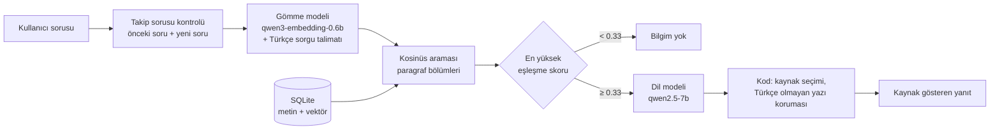

# Börteçine — Yerel Belge Asistanı

Tamamen çevrimdışı çalışan bir soru-cevap asistanı. Türk tarihi ve kültürü
üzerine hazırlanmış belgelere soru soruyorsunuz; sistem ilgili bölümleri kendi
veritabanında buluyor, bunları bir dil modeline bağlam olarak veriyor ve yanıtı
kaynak göstererek üretiyor. Hiçbir veri buluta gitmiyor — model, veritabanı ve
arama, hepsi aynı bilgisayarda çalışıyor.

Adını Ergenekon Destanı'nda topluluğa yolu gösteren bozkurttan alıyor.

Microsoft Foundry Local yaz stajı projesi kapsamında geliştirildi.

## Mimari



Beş adım var:

1. **Takip sorusu kontrolü.** Kısa bir soru ("sonucu ne oldu?") önceki soruyla
   birlikte de aranır. Birleşik arama belirgin biçimde daha iyi eşleşirse
   (skor farkı ≥ 0.20) o kullanılır; konu değiştiğinde soru tek başına aranır.
2. **Gömme ve arama.** Soru, "Soruyu cevaplayan paragrafı bul" talimatıyla
   vektöre çevrilir ve her biri bir paragraf olan bölümlerle karşılaştırılır.
3. **Eşik.** En iyi bölümün skoru 0.33'ün altındaysa soru dil modeline hiç
   gitmez. Bu eşik yalnızca açıkça konu dışı soruları ayıklar. Konuya yakın ama
   belgelerde cevabı olmayan soruları dil modeli reddeder, çünkü bu soruların
   skoru cevaplanabilir soruların çoğundan yüksek çıkabiliyor ve hiçbir eşik iki
   grubu ayıramıyor.
4. **Üretim.** Dil modeli en iyi 3 bölümü bağlam olarak alır ve yalnızca bu
   bağlama dayanarak kısa bir yanıt yazar.
5. **Son kontroller (kod).** Kaynak satırını model değil kod yazar: yanıtın
   hangi bölümle örtüştüğüne bakılır, reddetme yanıtına kaynak eklenmez. Yanıtta
   Çince/Japonca/Korece yazı çıkarsa o noktadan önceki son cümlede kesilir.

Foundry Local, modeli OpenAI uyumlu bir HTTP uç noktası üzerinden sunuyor. Bu
sayede uygulama kodu belirli bir sağlayıcıya bağlı değil: yalnızca temel adres
değiştirilerek başka bir arka uca yönlendirilebilir.

## Kurulum (Windows)

```powershell
winget install Microsoft.FoundryLocal
# PowerShell'i kapatıp yeniden açın

# NVIDIA ekran kartı için CUDA sürümleri (tam varyant adıyla)
foundry model download qwen3-embedding-0.6b-cuda-gpu
foundry model download qwen2.5-7b-instruct-cuda-gpu

python -m venv .venv
.venv\Scripts\activate
pip install -r requirements.txt

python ingest.py
python embed.py
```

**Model varyantı:** Yalnızca takma adla indirmek (`foundry model download
qwen2.5-7b`) donanıma uymayan bir sürümü (ör. NPU/OpenVINO) seçebiliyor.
Uygun varyantları `foundry model info qwen2.5-7b` ile görüp tam adla indirin.
Uygulama modeli adında `qwen2.5-7b` geçen indirilmiş model olarak bulur.

PowerShell betik çalıştırmayı engellerse:
`Set-ExecutionPolicy -Scope Process -ExecutionPolicy Bypass`

Proje RTX 5070 Laptop (8 GB) ile Windows 11 üzerinde ölçüldü.

## Kurulum (macOS)

```bash
brew tap microsoft/foundrylocal
brew install foundrylocal

foundry model download qwen3-embedding-0.6b
foundry model download qwen2.5-7b

python3 -m venv .venv
source .venv/bin/activate
pip install -r requirements.txt

python ingest.py
python embed.py
```

Foundry Local şu an Windows ve macOS destekliyor. Linux'ta, OpenAI uyumlu API
sunan başka bir çalışma zamanı (örneğin Ollama) `FOUNDRY_ENDPOINT` ortam
değişkeniyle kullanılabilir.

## Çalıştırma

```bash
streamlit run app.py    # tarayıcı arayüzü
python masaustu.py      # masaüstü penceresi (Tkinter)
python rag.py "soru"    # komut satırı
```

Üç arayüz de aynı `answer()` fonksiyonunu çağırır; iş mantığı tek yerdedir.

**İlk soru ~15 saniye sürer, sonrakiler 2–4 saniye.** Uygulama açılışta dil
modelini belleğe ilk sırada yükleyip en uzun istemle ısıtır, gömme modeli
ondan sonra yüklenir. Sıra ters olursa 8 GB'lik ekran kartında dil modeli yavaş
belleğe düşüyor ve yanıtlar ~50 saniyeye çıkıyor. Foundry sunucusu uygulamadan
bağımsız açık kaldığı için uygulama açılışta bellek düzenini ölçer; bozuksa
sunucuyu kendisi yeniden başlatır.

Yanıtlar sürekli 5 saniyeyi aşıyorsa uygulamayı kapatıp `foundry server stop`
çalıştırın ve yeniden açın. Aynı anda başka bir programın ekran kartını yoğun
kullanması da süreleri uzatır.

Kendi belgelerinizi kullanmak için `docs/` klasörünün içeriğini değiştirip
`ingest.py` ve `embed.py` komutlarını tekrar çalıştırmanız yeterli.

## Proje yapısı

| Dosya | Görevi |
|---|---|
| `ingest.py` | Belgeleri paragraf başına bir bölüme ayırır, başına başlık yolunu ekler, SQLite'a yazar; anahtar kelime indeksini kurar |
| `embed.py` | Her bölüm için gömme vektörü üretir, BLOB olarak saklar |
| `search.py` | Soruyu talimatla gömer, kosinüs benzerliğiyle en yakın bölümleri bulur |
| `rag.py` | Takip sorusu kuralı, eşik, istem, dil modeli çağrısı, kaynak seçimi, yanıt korumaları |
| `foundry_client.py` | Foundry Local uç noktasını bulur, modelleri doğru sırada yükler ve ısıtır |
| `app.py` | Streamlit web arayüzü |
| `masaustu.py` | Tkinter masaüstü arayüzü |
| `evaluate.py` | `eval_set.py`'deki soruları çalıştırır, sonuçları `degerlendirmeler/` klasörüne tarihli rapor olarak yazar |
| `eval_set.py` | Değerlendirme soruları: ana set ve kontrol seti |
| `degerlendirmeler/` | Her ölçümün raporu (`.md`) ve ham sonucu (`.json`) |
| `muhammet_ws/` | İyileştirme planı, ölçüm raporları ve teşhis betikleri |

## Belge koleksiyonu

`docs/` klasöründe Türk tarihi ve kültürü üzerine 13 belge, toplam 86 paragraf
bölümü bulunuyor: ilk Türk devletleri, Selçuklular ve Malazgirt, Osmanlı
padişahları, Çanakkale ve Kurtuluş Savaşı, Cumhuriyet dönemi, Türk kültüründe at
ve kurt, Türk destanları, devlet geleneği, Türkçenin tarihi, milliyetçilik
akımının doğuşu ve öne çıkan isimler.

Belgeler yayımlanmış kaynaklardan derlenerek yazılmıştır. Kaynağı
doğrulanamayan anlatılar, olgu olarak değil, doğrulanmamış oldukları belirtilerek
aktarılmıştır.

## Değerlendirme

İki soru seti var:

- **Ana set (105 soru):** 13 belgenin hepsinden 65 cevaplanabilir ve 10
  cevaplanamaz soru, ayrıca 15 çok turlu senaryo (takip sorusu, konu değişimi,
  önceki sorudan sonra konu dışı soru). Ayarlar bu sete bakılarak yapıldı.
- **Kontrol seti (58 soru, 43'ü puanlanan):** Sonuçları görülmeden yazılıp
  dondurulmuş sorular. Ayar yapmak için kullanılmaz; ayarların bu sete fazla
  uyup uymadığını gösterir.

Her sorunun beklenen paragrafı, parça numarasıyla değil paragraftan alınmış bir
ifadeyle tanımlı; parçalama değişince set geçerli kalıyor. Ölçümler
`temperature=0` ile yapılıyor.

```bash
python evaluate.py --kontrol                          # seti modelsiz doğrula
python evaluate.py --etiket deneme                    # ana set
python evaluate.py --set kontrol --etiket deneme      # kontrol seti
python evaluate.py --etiket deneme --karsilastir degerlendirmeler/<onceki>.json
```

**Son ölçüm** (qwen2.5-7b, RTX 5070 8 GB; raporlar:
[`2026-09-15_0119_nihai.md`](degerlendirmeler/2026-09-15_0119_nihai.md),
[`2026-09-15_0124_kontrol_nihai.md`](degerlendirmeler/2026-09-15_0124_kontrol_nihai.md)):

| Ölçüt | Ana set | Kontrol seti |
|---|---|---|
| Tam başarı (otomatik) | **%95.6** | **%88.4** |
| Doğru bölüm ilk sırada / ilk üçte | %87.8 / %95.9 | %85.2 / %88.9 |
| Yanlış red (cevap belgede varken) | %2.7 | %7.4 |
| Doğru kaynak | %98.6 | %100 |
| Cevaplanamaz soruları reddetme | %100 | %87.5 |
| Gözle kontrol: yanlış bilgi içeren yanıt | 3 / 74 | 2 / 27 |
| Gözle kontrol: cevaplanamaz soruya uydurma | 0 / 16 | 2 / 16 |
| Ortalama yanıt süresi | 2.2 sn | 2.2 sn |

Otomatik puanlama anahtar ifadelere ve kaynağa bakar; yanıtın geri kalanındaki
yanlışları kaçırabildiği için yanıtlar ayrıca gözle kontrol edildi.

Başlangıç ölçümüyle karşılaştırma ve bütün ara adımlar:
[`muhammet_ws/nihai_olcum_raporu.md`](muhammet_ws/nihai_olcum_raporu.md).
İlk sürümün 12 soruluk setteki sonuçları: [`eval_results.md`](eval_results.md).

## Yapılan deneyler

Her deney tek değişiklik olarak uygulanıp 105 soruluk setle ölçüldü.
Ayrıntılar ve kararların gerekçesi:
[`muhammet_ws/rag_iyilestirme_plani.md`](muhammet_ws/rag_iyilestirme_plani.md).

| Değişiklik | Gerekçe | Sonuç |
|---|---|---|
| Bellek yükleme sırası ve açılışta ısıtma | Gömme modeli önce yüklenince dil modeli yavaş belleğe düşüyordu | Yanıt süresi ~48 sn → ~2 sn |
| Paragraf başına bölüm + başlık yolu, örtüşme kaldırıldı | 900 karakterlik bölümler farklı alt konuları karıştırıyor, bölümlerin çoğu kelime ortasından başlıyordu | Tam başarı %67.8 → %76.7 |
| Türkçe sorgu talimatı | Kısa kavram soruları ("Kut nedir?") zayıf eşleşiyordu. İngilizce genel talimat aramayı kötüleştirdi | %76.7 → %85.6 |
| Takip sorusu kuralı skor farkına bağlandı, eşik 0.42 → 0.33 | Eski kural eşiğe bağlıydı ve talimatla bozuldu; eşik doğru bulunan bölümleri reddediyordu | %85.6 → %87.8 |
| Kaynak satırını kod belirliyor | Model yanlış belgeyi gösteriyor, reddetme yanıtına kaynak ekliyordu | %87.8 → **%95.6** |
| Türkçe olmayan yazı koruması | Model yanıtın ortasında Çince'ye geçebiliyordu | Kontrol setinde 1 yanıt düzeldi |
| Önceki soruyu dil modeline göstermek | Takip sorularında modelin neyin sorulduğunu bilmesi | Uydurma getirdi, **geri alındı** |
| `TOP_K` 3 → 5 | Bazı doğru bölümler 4.–5. sıradaydı | Başarı düştü, süre 7 sn'ye çıktı, **geri alındı** |
| qwen3-4b | Daha küçük ve hızlı model | Aynı 62 soruda 52'ye karşı 60 başarı, Foundry'yi çökertti, **reddedildi** |
| Hibrit arama (anahtar kelime + vektör) | Özel adlarda vektör araması doğru bölümü aşağıda bırakabiliyordu | Arama iyileşti (ilk üçte %100) ama uydurma arttı, **kapalı** |
| Yanıt doğrulama adımı (ikinci model çağrısı) | Konuya yakın tuzak sorulardaki uydurmalar | Uydurmaları yakaladı ama 10–11 doğru yanıtı da reddetti, **kapalı** |

Kapalı seçenekler kodda duruyor ve deney için ortam değişkenleriyle açılabiliyor:
`LRA_HYBRID=1`, `LRA_VERIFY=1`, `LRA_TOP_K`, `LRA_CHAT_MODEL`.

**İlk sürümdeki deneyler (12 soruluk set):** bölüm boyutu 500 → 900,
`max_tokens` sınırı ve kısalık talimatı (45 sn → 10 sn), `temperature` 0.2 →
0.0, reddetme kuralının istemin başına alınması (10/12 → 11/12), `TOP_K` 3 → 5
denemesi (geri alındı), qwen3-4b → qwen2.5-7b (11/12 → 12/12), takip sorularında
önceki sorunun aramaya eklenmesi, bağlantı dayanıklılığı. Bu dönemde denenen
üç kademeli eşik (0.30 / 0.42) mevcut kodda bulunmuyor; eşik mantığı yukarıdaki
ölçümlerle yeniden kuruldu.

## Tasarım kararları

**Kaba kuvvet arama.** 86 bölüm için tüm vektörler belleğe okunup tek bir NumPy
çarpımıyla karşılaştırılıyor. Bu ölçekte yaklaşık en yakın komşu indeksi kurmak
gereksiz karmaşıklık olurdu.

**Vektörler BLOB olarak.** `float32` ham baytları, JSON'a çevirmekten hem daha
hızlı hem daha az yer kaplıyor.

**Paragraf başına bir bölüm.** Belgelerde her paragraf tek bir alt konuyu
anlatıyor. Paragrafları birleştirmek farklı konuları aynı vektöre karıştırıyordu.
Başa eklenen başlık yolu ("Belge — Alt başlık"), paragrafın kime veya neye ait
olduğunu taşıyor.

**Eşik bir güvenlik tabanı, asıl reddetme kararı dil modelinde.** Ölçümlerde
belgede cevabı olmayan ama konuya yakın sorular 0.52–0.69 skor alırken
cevaplanabilir sorular 0.35'ten başlıyordu. Tek bir skorla iki grubu ayırmak
mümkün olmadığı için eşik yalnızca açıkça konu dışı soruları ayıklıyor.

**Kaynak satırı kodda.** Dil modeli kaynak satırı yazmaya devam ediyor (bu satırı
istemden çıkarmak modeli doğru soruları da reddetmeye itti), ama kod bu satırı
siliyor ve kaynağı yanıtın bölümlerle örtüşmesine göre kendisi ekliyor.

**Değişiklikler ölçümle kabul ediliyor.** Her değişiklik tek başına uygulanıp
aynı soru setiyle ölçüldü; kabul ölçütleri ölçümden önce yazıldı. Arama
ölçütlerini iyileştirdiği halde uydurmayı artıran değişiklikler kapalı tutuldu.

**Arayüz iş mantığından ayrı.** Üç farklı arayüz aynı çekirdeği kullanıyor;
hiçbiri arama veya üretim koduna dokunmuyor.

## Bilinen sınırlar

**Konuya yakın tuzak sorularda uydurma.** Belgede benzer ama farklı bir olay
varken sorulan sorularda model zaman zaman o olayı yanıt gibi sunuyor
(ör. Kurtuluş Savaşı'ndaki bir komutanlık sorulduğunda Birinci Dünya Savaşı'ndaki
görevi anlatmak). Kontrol setinde 16 cevaplanamaz sorudan 2'si böyle yanıtlandı.
Eşik, istem ve ikinci bir doğrulama çağrısıyla denendi; bu model ve donanımla
başka bir şeyi bozmadan çözülemedi.

**Eksik takip soruları.** "ne zaman yıkıldı?" gibi bir soru tek başına başka bir
konuya da uyabiliyorsa, önceki soruyla birleşik arama devreye girmeyebilir ve
model başka bir konuyu yanıtlayabilir.

**Değerlendirme setleri sisteme göre ayarlandı.** Ana set üzerinde iteratif
iyileştirme yapıldı; kontrol setini de ana setin sonuçlarını görmüş olan kişi
yazdı. Gerçek başarı, sonuçları hiç görülmemiş bağımsız bir testle ölçülmeli
([`muhammet_ws/bagimsiz_test_rehberi.md`](muhammet_ws/bagimsiz_test_rehberi.md)).

**Dil hataları.** Bilgi doğru olsa da yanıtlarda zaman zaman yazım hatası ve
kelime tekrarı görülüyor ("Göktürk Dev Devleti", "yirmirmi bir").

**Bellek sınırı.** 8 GB ekran kartında dil modeli ve gömme modeli birlikte sınırda
çalışıyor. Uygulama çalışırken başka bir program ekran kartı belleğini doldurursa
yavaşlama geri gelebilir.

**Takip sorusu tespiti basit.** Kelime sayısına ve skor farkına dayalı bir kural
kullanılıyor; soruyu konuşma geçmişiyle yeniden yazan bir adım yok.

**Yalnızca düz metin.** `.txt` ve `.md` okunuyor. PDF ve Word desteği için okuma
katmanının genişletilmesi gerekir.

## Sonraki adımlar

- Sonuçları görülmemiş sorularla bağımsız test
- Tuzak sorulardaki uydurma için daha güçlü bir model ya da ayrı bir doğrulayıcı
  model (8 GB'de ikisi birlikte sığmıyor)
- Soruyu konuşma geçmişiyle yeniden yazan bir adım
- PDF ve Word desteği
