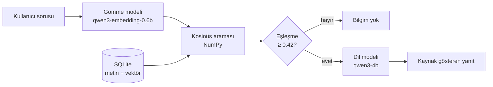

# Yerel RAG Belge Asistanı

Tamamen çevrimdışı çalışan bir soru-cevap asistanı. Bir belge koleksiyonuna
soru soruyorsunuz; sistem ilgili bölümleri kendi veritabanında buluyor, bu
bölümleri bir dil modeline bağlam olarak veriyor ve yanıtı kaynak göstererek
üretiyor. Hiçbir veri buluta gitmiyor — model, veritabanı ve arama, hepsi
aynı bilgisayarda çalışıyor.

Microsoft Foundry Local yaz stajı projesi kapsamında geliştirildi.

## Mimari



Dört katman var: soruyu vektöre çeviren **gömme** katmanı, saklanan
vektörlerle karşılaştıran **arama** katmanı, sonucu yazıya döken **üretim**
katmanı ve ikisinin arasında duran **eşik koruması**. Eşik, alakasız
soruların dil modeline hiç ulaşmamasını sağlıyor.

Foundry Local, modeli OpenAI uyumlu bir HTTP uç noktası üzerinden sunuyor.
Bu sayede uygulama kodu belirli bir sağlayıcıya bağlı değil: yalnızca temel
adres değiştirilerek başka bir arka uca yönlendirilebilir.

## Kurulum

Gereksinimler: macOS veya Windows, Python 3.11+, [Foundry Local](https://learn.microsoft.com/azure/ai-foundry/foundry-local/).

```bash
# Foundry Local (macOS)
brew tap microsoft/foundrylocal
brew install foundrylocal

# Modeller
foundry model download qwen3-embedding-0.6b
foundry model download qwen3-4b
foundry server start

# Proje
python3 -m venv .venv
source .venv/bin/activate
pip install -r requirements.txt
```

## Çalıştırma

```bash
python ingest.py     # belgeleri bölümlere ayır, SQLite'a yaz
python embed.py      # her bölüm için gömme vektörü üret
streamlit run app.py # web arayüzü
```

Terminalden kullanmak için:

```bash
python rag.py "RAG'in üç adımı nedir?"
python rag.py --debug "Vektörler neden BLOB olarak saklanır?"
```

Kendi belgelerinizi kullanmak için `docs/` klasörünün içeriğini değiştirip
`ingest.py` ve `embed.py` komutlarını tekrar çalıştırmanız yeterli.

## Proje yapısı

| Dosya | Görevi |
|---|---|
| `ingest.py` | Belgeleri paragraf sınırlarından bölümlere ayırır, SQLite'a yazar |
| `embed.py` | Her bölüm için gömme vektörü üretir, BLOB olarak saklar |
| `search.py` | Soruyu gömer, kosinüs benzerliğiyle en yakın bölümleri bulur |
| `rag.py` | Eşik kontrolü, istem oluşturma, dil modeli çağrısı |
| `evaluate.py` | 12 soruluk değerlendirme setini çalıştırır, rapor üretir |
| `app.py` | Streamlit web arayüzü |
| `foundry_client.py` | Foundry Local uç noktasını ve model adlarını bulur |

## Değerlendirme

12 soruluk bir set kullanıldı: 8'i belgelerden cevaplanabilir, 4'ü
cevaplanamaz (biri anlamsız girdi). Ölçümler `temperature=0` ile
yapıldığından tekrarlanabilir.

| Ölçüt | Sonuç |
|---|---|
| Genel başarı | **11 / 12** |
| Retrieval (hit@3) | **8 / 8** — doğru belge her seferinde ilk üçte |
| Doğru reddetme | 3 / 4 |
| Ortalama yanıt süresi | 10.1 sn |
| Eşikte reddedilen soruların süresi | < 0.3 sn |

Ayrıntılı tablo ve tüm yanıtlar: [`eval_results.md`](eval_results.md)

Dikkat çeken nokta: **arama katmanı kusursuz çalıştı.** Cevaplanabilir 8
sorunun tamamında doğru belge ilk üçe girdi. Sistemin tek zayıf noktası,
alakasız bir sorunun ne zaman reddedileceğine karar verme aşaması.

## Yapılan deneyler

Her satır bir hipotez, bir müdahale ve bir ölçüm içeriyor.

| Değişiklik | Gerekçe | Sonuç |
|---|---|---|
| Bölüm boyutu 500 → 900, örtüşme 100 → 200 | "RAG'in üç adımı" sorusunda model olmayan bir adım uydurmuştu; ilgili paragraf bölümlere ayrılırken ikiye bölünmüştü | Yanıt düzeldi, üç adım da doğru geldi |
| `max_tokens=400`, "en fazla 5 cümle" talimatı, `/no_think` | Yanıtlar gereksiz uzundu ve üretim süresi uzunlukla doğru orantılı | 45.2 sn → 10.0 sn |
| Eşik 0.45 → 0.42 | Cevabı belgelerde olan bir soru (skor 0.440) yanlışlıkla reddediliyordu | Yanlış reddetme ortadan kalktı |
| `temperature` 0.2 → 0.0 | Aynı girdi iki farklı sonuç veriyordu; ölçüm güvenilir değildi | Sonuçlar tekrarlanabilir hale geldi |
| Reddetme kuralı istemin başına alındı ve açık bir kontrol adımına dönüştürüldü | Kural listenin ortasındayken model onu atlıyordu | 10/12 → **11/12** |

## Tasarım kararları

**Kaba kuvvet arama.** 20 bölüm için tüm vektörler belleğe okunup tek bir
NumPy çarpımıyla karşılaştırılıyor. Bu ölçekte yaklaşık en yakın komşu
indeksi kurmak gereksiz karmaşıklık olurdu.

**Vektörler BLOB olarak.** `float32` ham baytları, JSON'a çevirmekten hem
daha hızlı hem daha az yer kaplıyor.

**Paragraf sınırından bölme.** Sabit karakter sayısıyla bölmek cümleleri
ortadan keser ve arama kalitesini düşürür.

**İki katmanlı reddetme.** Önce benzerlik eşiği (dil modeline hiç
gitmeden), sonra istemdeki açık talimat. İlk katman deterministik ve
hızlı, ikincisi esnek ama garantisiz.

## Bilinen sınırlar

**Eşik değeri bu veri setine göre ayarlandı.** 0.42, 12 soruluk bir sete
bakılarak seçildi. Daha büyük bir sette en iyi değer olmayabilir; farklı bir
belge koleksiyonunda yeniden ölçülmesi gerekir.

**Benzerlik skorları iç içe geçiyor.** Cevaplanabilir soruların en düşük
skoru 0.440, cevaplanamazların en yükseği 0.504. Tek bir skorla iki grubu
temiz ayıran bir eşik yok. Kalan hata (`Python'da bir listeyi nasıl ters
çeviririm?`) bundan kaynaklanıyor: belgelerde Python geçtiği için skor
yüksek çıkıyor ve soru dil modeline ulaşıyor. Çözümü yeniden sıralama
(reranking) katmanı olurdu.

**İstem talimatları garanti değil.** `temperature=0.2` ile aynı anlamsız
girdi bir çalıştırmada reddedildi, diğerinde yanıtlandı. Bu davranış
istemle yönlendirilebiliyor ama zorunlu kılınamıyor.

**Küçük modelin Türkçesi sınırlı.** İlk denemede phi-3.5-mini bozuk Türkçe
üretti; qwen3-4b'ye geçilerek düzeltildi. Mimaride hiçbir değişiklik
gerekmedi — yalnızca model adı değişti.

**Yalnızca düz metin.** `.txt` ve `.md` okunuyor. PDF ve Word desteği için
`ingest.py` içindeki okuma katmanının genişletilmesi gerekir.

**Bölüm sayısı az.** 5 belge, 20 bölüm. Sonuçlar bu ölçekte geçerli.

## Sonraki adımlar

- Yeniden sıralama katmanı ekleyerek kalan reddetme hatasını çözmek
- Değerlendirme setini 50+ soruya çıkarıp eşiği daha güvenilir ayarlamak
- PDF ve Word desteği
- Çok turlu konuşma (önceki soruya atıf yapabilme)