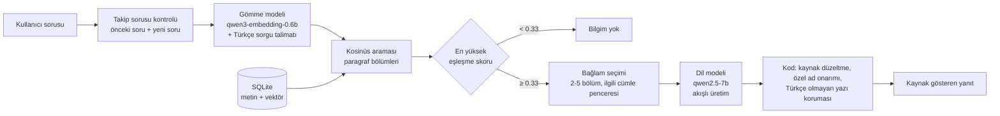

# Börteçine — Yerel Belge Asistanı

Tamamen çevrimdışı çalışan bir soru-cevap asistanı. Türk tarihi ve kültürü
üzerine hazırlanmış belgelere soru soruyorsunuz; sistem ilgili bölümleri kendi
veritabanında buluyor, bunları bir dil modeline bağlam olarak veriyor ve yanıtı
kaynak göstererek üretiyor. Hiçbir veri buluta gitmiyor — model, veritabanı ve
arama, hepsi aynı bilgisayarda çalışıyor.

Adını Ergenekon Destanı'nda topluluğa yolu gösteren bozkurttan alıyor.

Microsoft Foundry Local yaz stajı projesi kapsamında geliştirildi.

## Mimari



Altı adım var:

1. **Takip sorusu kontrolü.** Kısa bir soru ("sonucu ne oldu?") önceki soruyla
   birlikte de aranır. İşaret sözcüğü taşıyan sorularda ("peki **bunu** kim
   yaptı?") birleşik sorgu doğrudan kullanılır; işaretsiz kısa sorularda iki
   sorgu da denenir ve birleşik arama belirgin biçimde daha iyi eşleşirse
   (skor farkı ≥ 0.20) o kazanır. Konu değiştiğinde soru tek başına aranır.
2. **Gömme ve arama.** Soru, "Soruyu cevaplayan paragrafı bul" talimatıyla
   vektöre çevrilir ve her biri bir paragraf olan bölümlerle karşılaştırılır.
3. **Eşik.** En iyi bölümün skoru 0.33'ün altındaysa soru dil modeline hiç
   gitmez. Bu eşik yalnızca açıkça konu dışı soruları ayıklar. Konuya yakın ama
   belgelerde cevabı olmayan soruları dil modeli reddeder, çünkü bu soruların
   skoru cevaplanabilir soruların çoğundan yüksek çıkabiliyor ve hiçbir eşik iki
   grubu ayıramıyor.
4. **Bağlam seçimi.** Getirilen adaylardan 2–5 bölüm seçilir (baskın bir bölüm
   varsa az, skorlar birbirine yakınsa çok; aynı belgeden en fazla iki bölüm) ve
   her bölüm soruyla en çok örtüşen bitişik cümlelerine kırpılır. Yanıt süresinin
   neredeyse tamamı bağlamı okumakla geçiyor; kırpma doğruluğu düşürmeden
   bekleyişi kısaltıyor.
5. **Üretim.** Dil modeli yalnızca bu bağlama dayanarak kısa bir yanıt yazar.
   Yanıt akışlı gelir, arayüzler kelimeler üretildikçe yazar. Önceki iki turun
   soru ve kısaltılmış cevabı da modele taşınır.
6. **Son kontroller (kod).** Kaynak satırı tek biçime sokulur ve yanlış belgeyi
   gösteriyorsa düzeltilir: yanıtın hangi bölümle örtüştüğüne bakılır, reddetme
   yanıtına kaynak eklenmez. Bağlamda karşılığı olmayan özel adlar ("Türkş'in")
   en yakın gerçek yazımıyla onarılır. Yanıtta Çince/Japonca/Korece yazı çıkarsa
   o noktadan önceki son cümlede kesilir.

Foundry Local, modeli OpenAI uyumlu bir HTTP uç noktası üzerinden sunuyor. Bu
sayede uygulama kodu belirli bir sağlayıcıya bağlı değil: yalnızca temel adres
değiştirilerek başka bir arka uca yönlendirilebilir.

## Kurulum (Windows)

```powershell
winget install Microsoft.FoundryLocal
# PowerShell'i kapatıp yeniden açın

# NVIDIA ekran kartı için CUDA sürümleri (tam varyant adıyla)
foundry model download qwen3-embedding-0.6b-cuda-gpu
foundry model download qwen2.5-7b-instruct-cuda-gpu

python -m venv .venv
.venv\Scripts\activate
pip install -r requirements.txt

python ingest.py
python embed.py
```

**Model varyantı:** Yalnızca takma adla indirmek (`foundry model download
qwen2.5-7b`) donanıma uymayan bir sürümü (ör. NPU/OpenVINO) seçebiliyor.
Uygun varyantları `foundry model info qwen2.5-7b` ile görüp tam adla indirin.
Uygulama modeli adında `qwen2.5-7b` geçen indirilmiş model olarak bulur.

PowerShell betik çalıştırmayı engellerse:
`Set-ExecutionPolicy -Scope Process -ExecutionPolicy Bypass`

Proje RTX 5070 Laptop (8 GB) ile Windows 11 üzerinde ölçüldü.

## Kurulum (macOS)

```bash
brew tap microsoft/foundrylocal
brew install foundrylocal

foundry model download qwen3-embedding-0.6b
foundry model download qwen2.5-7b

python3 -m venv .venv
source .venv/bin/activate
pip install -r requirements.txt

python ingest.py
python embed.py
```

Foundry Local şu an Windows ve macOS destekliyor. Linux'ta, OpenAI uyumlu API
sunan başka bir çalışma zamanı (örneğin Ollama) `FOUNDRY_ENDPOINT` ortam
değişkeniyle kullanılabilir.

## Çalıştırma

```bash
streamlit run app.py    # tarayıcı arayüzü
python masaustu.py      # masaüstü penceresi (Tkinter)
python rag.py "soru"    # komut satırı
```

Üç arayüz de aynı `answer()` fonksiyonunu çağırır; iş mantığı tek yerdedir.

**Komutları depo klasörünün içinden çalıştırın.** Veritabanı yolu (`knowledge.db`)
göreli; başka bir klasörden çalıştırılırsa SQLite orada boş bir dosya açar ve
uygulama `no such table: chunks` hatası verir.

Masaüstü arayüzü hem macOS'ta hem Windows'ta çalışır; imleç ve yazı tipi adları
platforma göre seçilir (`masaustu.py` içindeki `EL_IMLECI`, `YAZI_AILESI`).
macOS'a özgü adlar Windows Tk'sinde pencereyi hiç açtırmıyor.

**İlk soru ~15 saniye sürer, sonrakiler 2–4 saniye.** Uygulama açılışta dil
modelini belleğe ilk sırada yükleyip en uzun istemle ısıtır, gömme modeli
ondan sonra yüklenir. Sıra ters olursa 8 GB'lik ekran kartında dil modeli yavaş
belleğe düşüyor ve yanıtlar ~50 saniyeye çıkıyor. Foundry sunucusu uygulamadan
bağımsız açık kaldığı için uygulama açılışta bellek düzenini ölçer; bozuksa
sunucuyu kendisi yeniden başlatır.

Yanıtlar sürekli 5 saniyeyi aşıyorsa uygulamayı kapatıp `foundry server stop`
çalıştırın ve yeniden açın. Aynı anda başka bir programın ekran kartını yoğun
kullanması da süreleri uzatır.

Kendi belgelerinizi kullanmak için `docs/` klasörünün içeriğini değiştirip
`ingest.py` ve `embed.py` komutlarını tekrar çalıştırmanız yeterli.

## Proje yapısı

| Dosya | Görevi |
|---|---|
| `ingest.py` | Belgeleri paragraf başına bir bölüme ayırır, başına başlık yolunu ekler, SQLite'a yazar; anahtar kelime indeksini kurar |
| `embed.py` | Her bölüm için gömme vektörü üretir, BLOB olarak saklar |
| `search.py` | Soruyu talimatla gömer, kosinüs benzerliğiyle en yakın bölümleri bulur |
| `rag.py` | Takip sorusu kuralı, eşik, istem, dil modeli çağrısı, kaynak seçimi, yanıt korumaları |
| `foundry_client.py` | Foundry Local uç noktasını bulur, modelleri doğru sırada yükler ve ısıtır |
| `app.py` | Streamlit web arayüzü |
| `masaustu.py` | Tkinter masaüstü arayüzü |
| `evaluate.py` | `eval_set.py`'deki soruları çalıştırır, sonuçları `degerlendirmeler/` klasörüne tarihli rapor olarak yazar |
| `eval_set.py` | Değerlendirme soruları: ana set ve kontrol seti |
| `degerlendirmeler/` | Her ölçümün raporu (`.md`) ve ham sonucu (`.json`) |
| `muhammet_ws/` | İyileştirme planı, ölçüm raporları ve teşhis betikleri |

## Belge koleksiyonu

`docs/` klasöründe Türk tarihi ve kültürü üzerine 27 belge, toplam 212 paragraf
bölümü bulunuyor.

- **Siyasi tarih:** ilk Türk devletleri, Türklerin İslamiyet'i kabulü ve ilk
  Türk-İslam devletleri, Selçuklular ve Malazgirt, Anadolu beylikleri ve
  Osmanlı'nın kuruluşu, Osmanlı padişahları, Osmanlı devlet teşkilatı,
  duraklama-ıslahat-Meşrutiyet dönemi, Çanakkale ve Kurtuluş Savaşı,
  Mustafa Kemal Atatürk, Cumhuriyet dönemi inkılapları, bugünkü Türk dünyası.
- **Kültür ve inanç:** Türk devlet geleneği ve töre, Türk mitolojisi ve Gök
  Tanrı inancı, Oğuz boyları ve boy yapısı, bozkır göçebe yaşamı, Türk
  kültüründe at, Türk kültüründe kurt, Türk destanları, Nevruz ve bayram
  gelenekleri, ozan-âşık geleneği.
- **Dil, bilim ve sanat:** Türkçenin tarihi ve alfabeler, ilk Türk-İslam
  eserleri, Türk-İslam dünyasında bilim, Selçuklu ve Osmanlı mimarisi,
  Türk denizciliği, millî semboller, Türk milliyetçiliğinin fikrî doğuşu.

Belgeler yayımlanmış kaynaklardan derlenerek yazılmıştır. Kaynağı
doğrulanamayan anlatılar, olgu olarak değil, doğrulanmamış oldukları belirtilerek
aktarılmıştır.

**Belge yazarken uyulan kural.** Her paragraf tek bir konuyu baştan sona
anlatmalı ve kendi kendine yeterli olmalıdır, çünkü arama birimi paragraftır.
Bir belgenin sahiplendiği terim, baskın konusu başka bir şey olan paragrafın
kuyruğuna eklenmemelidir: parçanın gömme vektörü o zaman terimi değil
paragrafın baskın konusunu anlatır ve terim aranınca bulunamaz. Aynı nedenle
bir konu birden fazla belgede anlatılmamalı; başka belgenin konusuna yalnızca
atıf yapılmalı, içeriği tekrar edilmemelidir. Yüzeysel bir değinme, konuyu asıl
anlatan paragrafı arama sırasında geçebilir.

Bu kuralın etkisi ölçüldü. "Ülüş" hükümdarlık sembollerini anlatan bir
paragrafın sonundayken arama sırası 7, kendi paragrafına alınınca 3 oldu;
"semeni" bir gelenek sıralamasının içindeyken 9, kendi paragrafında 1 oldu.
"Kımız" kendi paragrafına alındığında önce yetmedi, çünkü yeni paragrafa atı
anlatan bir cümle girmişti; paragraf baştan sona kımızı anlatır hâle
getirilince skor 0.346'dan 0.475'e çıktı ve sıra 1 oldu.

## Değerlendirme

İki soru seti var:

- **Ana set (175 soru, 160'ı puanlanan):** 27 belgenin hepsinden 135
  cevaplanabilir ve 10 cevaplanamaz tekil soru, ayrıca 15 çok turlu senaryo
  (takip sorusu, konu değişimi, önceki sorudan sonra konu dışı soru).
  Ayarlar bu sete bakılarak yapıldı.
- **Kontrol seti (56 soru, 41'i puanlanan):** Sonuçları görülmeden yazılıp
  dondurulmuş sorular. Ayar yapmak için kullanılmaz; ayarların bu sete fazla
  uyup uymadığını gösterir.

Her sorunun beklenen paragrafı, parça numarasıyla değil paragraftan alınmış bir
ifadeyle tanımlı; parçalama değişince set geçerli kalıyor. Ölçümler
`temperature=0` ile yapılıyor.

```bash
python evaluate.py --kontrol                          # seti modelsiz doğrula
python evaluate.py --etiket deneme                    # ana set
python evaluate.py --set kontrol --etiket deneme      # kontrol seti
python evaluate.py --etiket deneme --karsilastir degerlendirmeler/<onceki>.json
```

**Son ölçüm** (qwen2.5-7b, RTX 5070 8 GB, 27 belge / 212 bölüm; raporlar:
[`2026-09-18_2208_belge-siniri-080.md`](degerlendirmeler/2026-09-18_2208_belge-siniri-080.md),
[`2026-09-18_2220_kontrol_belge-siniri-080.md`](degerlendirmeler/2026-09-18_2220_kontrol_belge-siniri-080.md)):

| Ölçüt | Ana set | Kontrol seti | Önceki (13 belge / 86 bölüm) |
|---|---|---|---|
| Tam başarı (otomatik) | **%96.9** | **%82.9** | %95.6 / %86.0 |
| Doğru bölüm ilk sırada / ilk üçte | %86.1 / %96.5 | %80.0 / %92.0 | %87.8 / %95.9 |
| Cevaplanabilir sorularda başarı | %99.3 | %84.0 | %95.9 / %92.6 |
| Yanlış red (cevap belgede varken) | **%0.0** | %4.0 | %0.0 / %3.7 |
| Doğru kaynak | %99.3 | %87.5 | %98.6 / %100 |
| Cevaplanamaz soruları reddetme | %75.0 | %81.2 | %93.8 / %75.0 |
| Ortalama yanıt süresi | 2.3 sn | 2.6 sn | 2.5 sn |

Ana settekilerin 80'i yeni 16 belge için yazılmış sorulardır; bu grupta başarı
**%100**, eski sorularda %93.8. Süre ölçümü yalnızca Foundry sunucusu yeni
başlatıldığında geçerlidir; tablodaki değer bu koşula uyan bir koşumdan
alınmıştır.

**Kontrol setindeki fark.** Kontrol seti dondurulmuş olduğu için belge
koleksiyonu büyürken güncellenmedi. Kalan hataların ikisi ölçüm artefaktıdır:
"Manasçı kimdir?" ve "Otağ nedir?" sorularında sistem, kavramı asıl tanımlayan
yeni belgeyi kaynak gösteriyor, set ise kavramın yalnızca anıldığı eski belgeyi
bekliyor. Bu iki soruyu geçirmek için eski belgelere tanım eklemek, teste göre
içerik yazmak olurdu; yapılmadı. Geri kalan hataların çoğu cevaplanamaz soruları
reddetme sorunudur.

Kontrol setinin bağımsızlığı bu turda kısmen yitirildi: "Ülüş nedir?" ve
Dede Korkut sorularındaki başarısızlıklar incelenip belgeler buna göre
düzeltildi. Düzeltmeler genel bir kurala dayanıyor (aşağıya bakınız) ve
kontrol setinde geçmeyen terimler için de aynı kazancı verdi; yine de bundan
sonraki kontrol skoru eskisi kadar bağımsız sayılmamalıdır. Yeni bir kontrol
seti yazılması gerekir.

Otomatik puanlama anahtar ifadelere ve kaynağa bakar; yanıtın geri kalanındaki
yanlışları kaçırabildiği için yanıtların ayrıca gözle kontrol edilmesi gerekir.
Bu dal için gözle kontrol henüz yapılmadı; önceki sürümün gözle kontrol
sonuçları [`muhammet_ws/nihai_olcum_raporu.md`](muhammet_ws/nihai_olcum_raporu.md)
içinde.

Bu dal bağlam seçimini `masaustu_gui` dalından aldı: yanlış redler sıfıra indi,
buna karşılık cevaplanamaz sorularda model bir iki soruda daha uydurmaya
yatkın. İki tarafın toplamı ana sette eşit çıkıyor. Kontrol setindeki süreler
ölçüm sırasında ekran kartı belleği bozuk düzende olduğu için geçersiz;
doğruluk ölçütleri bundan etkilenmiyor.

Başlangıç ölçümüyle karşılaştırma ve bütün ara adımlar:
[`muhammet_ws/nihai_olcum_raporu.md`](muhammet_ws/nihai_olcum_raporu.md).
İlk sürümün 12 soruluk setteki sonuçları: [`eval_results.md`](eval_results.md).

## Yapılan deneyler

Her deney tek değişiklik olarak uygulanıp 105 soruluk setle ölçüldü.
Ayrıntılar ve kararların gerekçesi:
[`muhammet_ws/rag_iyilestirme_plani.md`](muhammet_ws/rag_iyilestirme_plani.md).

| Değişiklik | Gerekçe | Sonuç |
|---|---|---|
| Bellek yükleme sırası ve açılışta ısıtma | Gömme modeli önce yüklenince dil modeli yavaş belleğe düşüyordu | Yanıt süresi ~48 sn → ~2 sn |
| Paragraf başına bölüm + başlık yolu, örtüşme kaldırıldı | 900 karakterlik bölümler farklı alt konuları karıştırıyor, bölümlerin çoğu kelime ortasından başlıyordu | Tam başarı %67.8 → %76.7 |
| Türkçe sorgu talimatı | Kısa kavram soruları ("Kut nedir?") zayıf eşleşiyordu. İngilizce genel talimat aramayı kötüleştirdi | %76.7 → %85.6 |
| Takip sorusu kuralı skor farkına bağlandı, eşik 0.42 → 0.33 | Eski kural eşiğe bağlıydı ve talimatla bozuldu; eşik doğru bulunan bölümleri reddediyordu | %85.6 → %87.8 |
| Kaynak satırını kod belirliyor | Model yanlış belgeyi gösteriyor, reddetme yanıtına kaynak ekliyordu | %87.8 → **%95.6** |
| Türkçe olmayan yazı koruması | Model yanıtın ortasında Çince'ye geçebiliyordu | Kontrol setinde 1 yanıt düzeldi |
| Önceki soruyu dil modeline göstermek | Takip sorularında modelin neyin sorulduğunu bilmesi | Uydurma getirdi, **geri alındı** |
| `TOP_K` 3 → 5 | Bazı doğru bölümler 4.–5. sıradaydı | Başarı düştü, süre 7 sn'ye çıktı, **geri alındı** |
| qwen3-4b | Daha küçük ve hızlı model | Aynı 62 soruda 52'ye karşı 60 başarı, Foundry'yi çökertti, **reddedildi** |
| Hibrit arama (anahtar kelime + vektör) | Özel adlarda vektör araması doğru bölümü aşağıda bırakabiliyordu | Arama iyileşti (ilk üçte %100) ama uydurma arttı, **kapalı** |
| Yanıt doğrulama adımı (ikinci model çağrısı) | Konuya yakın tuzak sorulardaki uydurmalar | Uydurmaları yakaladı ama 10–11 doğru yanıtı da reddetti, **kapalı** |
| Bağlam seçimi + ilgili cümle penceresi (`masaustu_gui` dalından) | Yanıt süresinin neredeyse tamamı bağlamı okumakla geçiyor | Yanlış red %2.7 → **%0.0**, bağlam ~800–1800 karakter |
| Önceki soruyu modele göstermek, "yeniden cevaplama" uyarısıyla (`masaustu_gui` dalından) | Uyarının ilk denemedeki uydurmayı engelleyebileceği düşünüldü | Engellemedi: cevaplanamaz soruyu reddetme %93.8 → %68.8, **geri alındı** |
| Sözcüksel örtüşme payını skora karıştırmak (`masaustu_gui` dalından) | Özel adlarda vektör araması zayıf | Aynı işi hibrit arama ölçülmüş haliyle yapıyor, **kapalı** (`LRA_LEXICAL`) |

Kapalı seçenekler kodda duruyor ve deney için ortam değişkenleriyle açılabiliyor:
`LRA_HYBRID=1`, `LRA_LEXICAL=0.15`, `LRA_FOLLOW_UP_TO_MODEL=1`, `LRA_TOP_K`,
`LRA_MIN_SCORE`, `LRA_CHAT_MODEL`.

**İlk sürümdeki deneyler (12 soruluk set):** bölüm boyutu 500 → 900,
`max_tokens` sınırı ve kısalık talimatı (45 sn → 10 sn), `temperature` 0.2 →
0.0, reddetme kuralının istemin başına alınması (10/12 → 11/12), `TOP_K` 3 → 5
denemesi (geri alındı), qwen3-4b → qwen2.5-7b (11/12 → 12/12), takip sorularında
önceki sorunun aramaya eklenmesi, bağlantı dayanıklılığı. Bu dönemde denenen
üç kademeli eşik (0.30 / 0.42) mevcut kodda bulunmuyor; eşik mantığı yukarıdaki
ölçümlerle yeniden kuruldu.

## Tasarım kararları

**Kaba kuvvet arama.** 86 bölüm için tüm vektörler belleğe okunup tek bir NumPy
çarpımıyla karşılaştırılıyor. Bu ölçekte yaklaşık en yakın komşu indeksi kurmak
gereksiz karmaşıklık olurdu.

**Vektörler BLOB olarak.** `float32` ham baytları, JSON'a çevirmekten hem daha
hızlı hem daha az yer kaplıyor.

**Paragraf başına bir bölüm.** Belgelerde her paragraf tek bir alt konuyu
anlatıyor. Paragrafları birleştirmek farklı konuları aynı vektöre karıştırıyordu.
Başa eklenen başlık yolu ("Belge — Alt başlık"), paragrafın kime veya neye ait
olduğunu taşıyor.

**Eşik bir güvenlik tabanı, asıl reddetme kararı dil modelinde.** Ölçümlerde
belgede cevabı olmayan ama konuya yakın sorular 0.52–0.69 skor alırken
cevaplanabilir sorular 0.35'ten başlıyordu. Tek bir skorla iki grubu ayırmak
mümkün olmadığı için eşik yalnızca açıkça konu dışı soruları ayıklıyor.

**Kaynak satırı kodda.** Dil modeli kaynak satırı yazmaya devam ediyor (bu satırı
istemden çıkarmak modeli doğru soruları da reddetmeye itti), ama kod bu satırı
siliyor ve kaynağı yanıtın bölümlerle örtüşmesine göre kendisi ekliyor.

**Değişiklikler ölçümle kabul ediliyor.** Her değişiklik tek başına uygulanıp
aynı soru setiyle ölçüldü; kabul ölçütleri ölçümden önce yazıldı. Arama
ölçütlerini iyileştirdiği halde uydurmayı artıran değişiklikler kapalı tutuldu.

**Arayüz iş mantığından ayrı.** Üç farklı arayüz aynı çekirdeği kullanıyor;
hiçbiri arama veya üretim koduna dokunmuyor.

## Bilinen sınırlar

**Konuya yakın tuzak sorularda uydurma.** Belgede benzer ama farklı bir olay
varken sorulan sorularda model zaman zaman o olayı yanıt gibi sunuyor
(ör. Kurtuluş Savaşı'ndaki bir komutanlık sorulduğunda Birinci Dünya Savaşı'ndaki
görevi anlatmak). Kontrol setinde 16 cevaplanamaz sorudan 2'si böyle yanıtlandı.
Eşik, istem ve ikinci bir doğrulama çağrısıyla denendi; bu model ve donanımla
başka bir şeyi bozmadan çözülemedi.

**Eksik takip soruları.** "ne zaman yıkıldı?" gibi bir soru tek başına başka bir
konuya da uyabiliyorsa, önceki soruyla birleşik arama devreye girmeyebilir ve
model başka bir konuyu yanıtlayabilir.

**Değerlendirme setleri sisteme göre ayarlandı.** Ana set üzerinde iteratif
iyileştirme yapıldı; kontrol setini de ana setin sonuçlarını görmüş olan kişi
yazdı. Gerçek başarı, sonuçları hiç görülmemiş bağımsız bir testle ölçülmeli
([`muhammet_ws/bagimsiz_test_rehberi.md`](muhammet_ws/bagimsiz_test_rehberi.md)).

**Dil hataları.** Bilgi doğru olsa da yanıtlarda zaman zaman yazım hatası ve
kelime tekrarı görülüyor ("Göktürk Dev Devleti", "yirmirmi bir").

**Bellek sınırı.** 8 GB ekran kartında dil modeli ve gömme modeli birlikte sınırda
çalışıyor. Uygulama çalışırken başka bir program ekran kartı belleğini doldurursa
yavaşlama geri gelebilir.

**Takip sorusu tespiti basit.** Kelime sayısına ve skor farkına dayalı bir kural
kullanılıyor; soruyu konuşma geçmişiyle yeniden yazan bir adım yok.

**Yalnızca düz metin.** `.txt` ve `.md` okunuyor. PDF ve Word desteği için okuma
katmanının genişletilmesi gerekir.

## Sonraki adımlar

- Sonuçları görülmemiş sorularla bağımsız test
- Tuzak sorulardaki uydurma için daha güçlü bir model ya da ayrı bir doğrulayıcı
  model (8 GB'de ikisi birlikte sığmıyor)
- Soruyu konuşma geçmişiyle yeniden yazan bir adım
- PDF ve Word desteği
